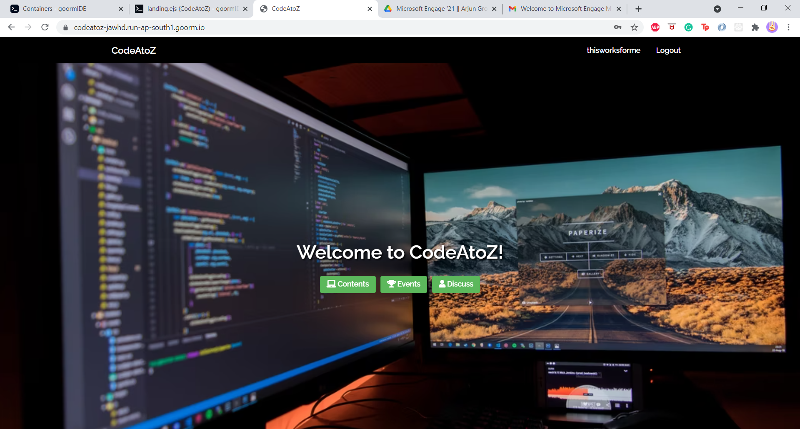
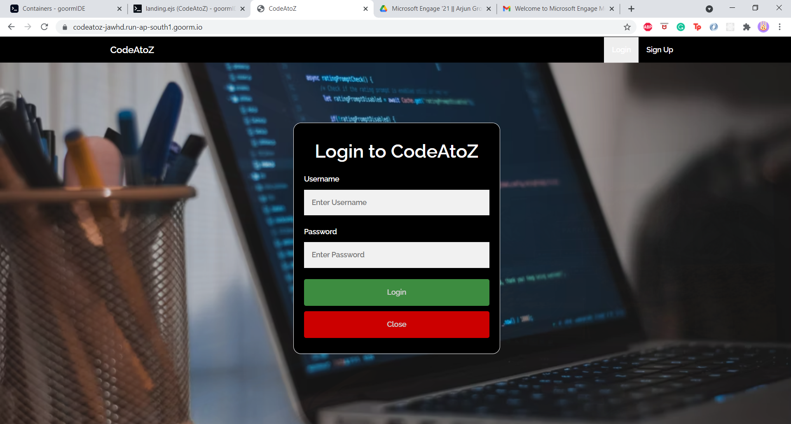
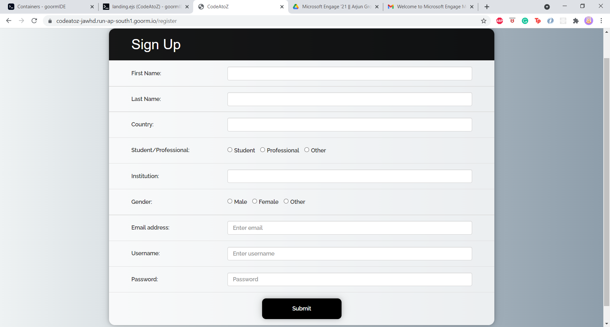
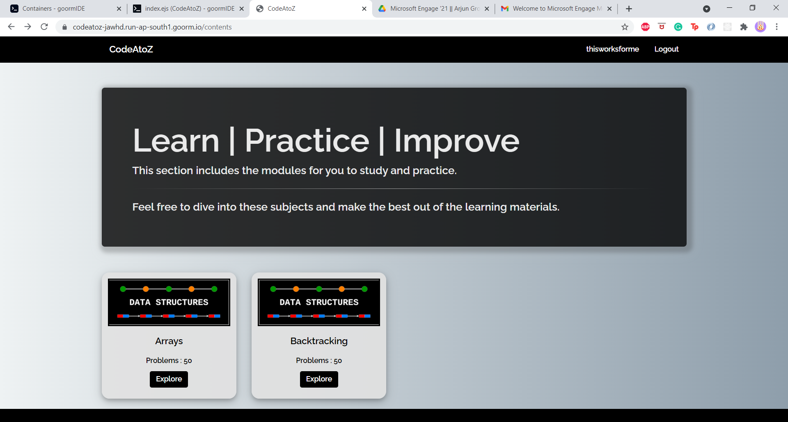
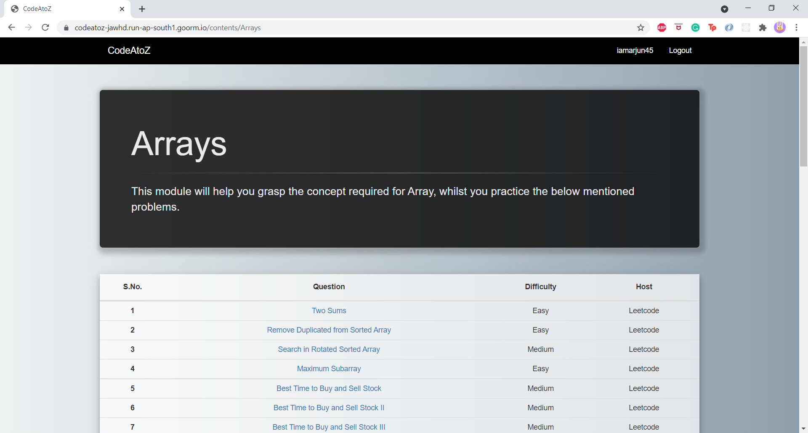
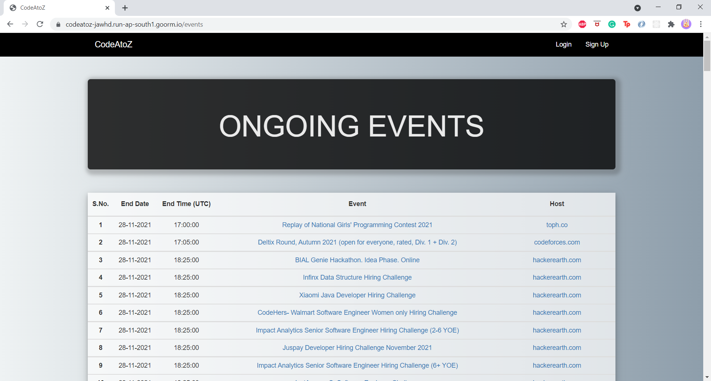
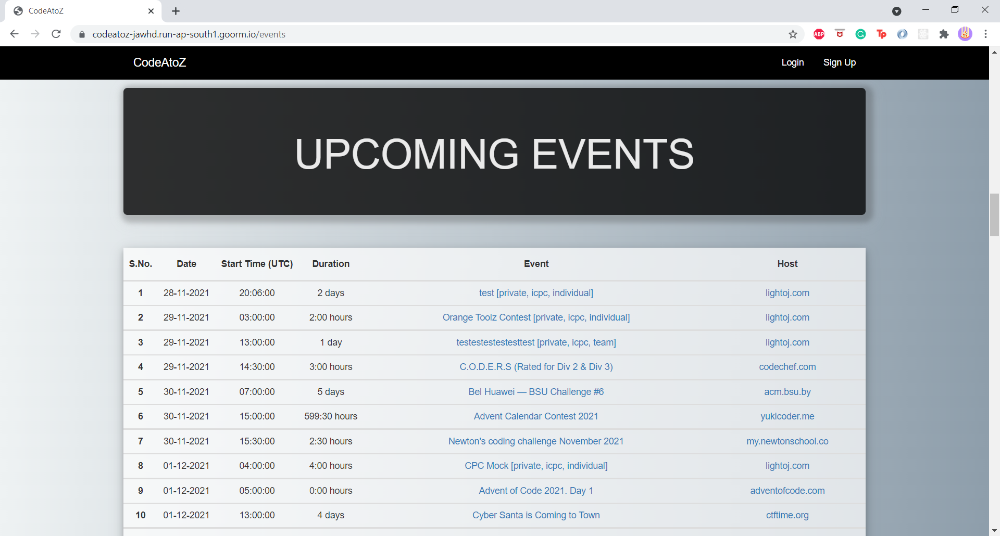
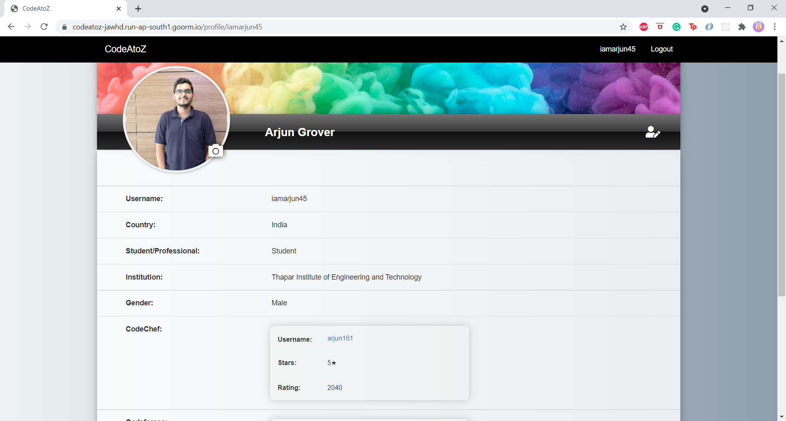
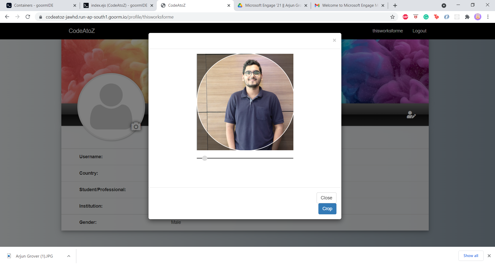
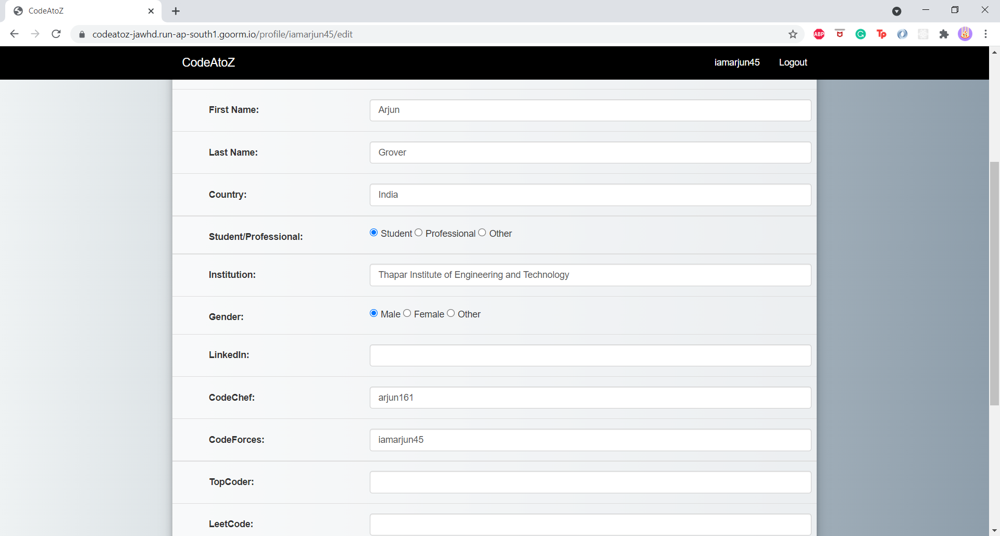

# CodeAToZ

## ABOUT
CodeAToZ is a platform that allows:
1. Students to access contents added by professionals/teachers for the students to explore and learn from.
2. This platform will create awareness about the ongoing and upcoming events in the field of computer Science.
3. Collaborate/Compete amongst themselves by updating the profile details on various comeptitive programming platforms.

## How to start?
1. Clone this github repository.
2. Start the Mongo Demon to access the database. `mongod`
3. Start the node application. `node app.js`

## Demo
1. Landing Page 

2. Login Popup

3. Registration Page

4. Contents Page

5. Module Page

6. Events Page - Ongoing Events

7. Events Page - Upcoming Events

8. Profile Page

9. Edit Profile Picture

10. Profile Page - Edit

